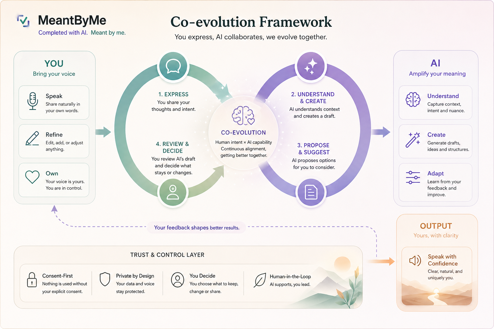
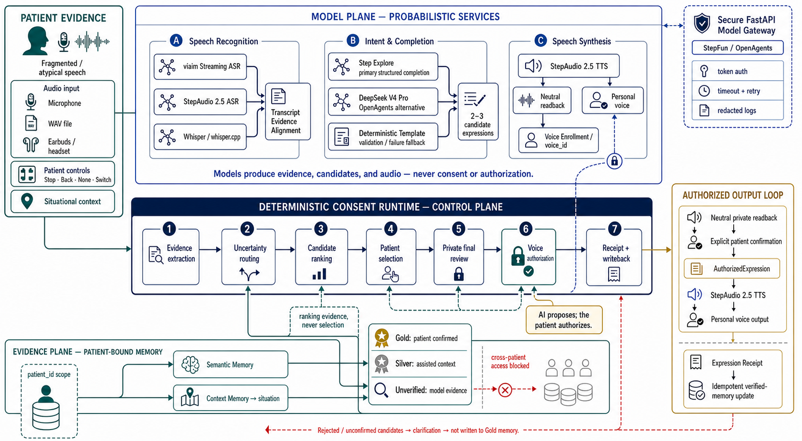

# MeantByMe

> **Completed with AI. Meant by me.**

[简体中文](README.zh-CN.md) ·
[Project Hub](https://cza1006.github.io/MeantByMe/) ·
[Web Demo](https://cza1006.github.io/MeantByMe/demo.html) ·
[Documentation](docs/README.md)

## Overview

MeantByMe is a **consent-first communication agent** for people whose intent
remains relatively clear while speech is fragmented, slow, impaired, or
temporarily unavailable.

The system may use speech recognition, context, and personal memory to propose
candidate expressions, but these inputs are **evidence—not authority**. AI may
help complete a sentence; the person must explicitly confirm its meaning,
verified-memory write, and personal-voice authorization.

> **Core principle: AI proposes; the patient decides. Models produce evidence;
> the deterministic runtime controls consent.**

## Co-evolution framework



“Co-evolution” means auditable personalization based on explicit,
provenance-preserving confirmation. It does not allow AI to learn, authorize,
or write Gold Memory from silence, timeout, caregiver action, or model
confidence. This is a product-concept diagram, not a clinical or security
certification.

## Safety contract

- Unconfirmed candidates never use the patient's personal voice.
- Silence, timeout, caregiver action, confidence, and device presence are not
  consent.
- AI output never writes directly to Gold Patient Memory.
- Caregiver context remains distinguishable from patient-confirmed intent.
- Rejected candidates never become patient preferences.
- Medical, legal, financial, and major relationship expressions require
  stricter confirmation.
- `Stop`, `Back`, `None of these`, and `Switch input method` remain available.
- Every external expression is traceable to evidence, AI completion,
  confirmation method, and authorization state.

The complete engineering invariants are in [AGENTS.md](AGENTS.md); accepted
implementation decisions are in [DECISIONS.md](DECISIONS.md).

## Simple flow

```text
fragmented speech or alternative input
→ ASR and contextual evidence
→ patient-scoped verified-memory retrieval
→ clarification or candidate expressions
→ explicit patient selection
→ private final readback
→ current-expression authorization
→ personal-voice output
→ Expression Receipt
→ idempotent verified-memory update
```

Personal voice is used only when both the final content and the current
expression authorization have been explicitly confirmed.

## Repository status

This repository contains several implementation tracks. Branch names describe
development history rather than clean component boundaries.

| Track | Branch | Current contents | Verified tests |
|---|---|---|---:|
| Canonical baseline and project hub | `main` | Deterministic mock runtime, schemas, safety policies, documentation, GitHub Pages | 24 |
| Integrated Web/backend prototype | `develop`, `frontend` | Same commit: runtime, gateway, responsive Web BFF/demo, cloud adapters, evaluation | 142 |
| Headset/mobile experiment | `feature/earPhones` | iOS, Viaim headset adapter, command/QA and profile-storage experiments | 172 |

Test counts were independently verified on 2026-07-26 with Python 3.11.8.
`develop` and `frontend` currently point to the same commit. The mobile branch
is a broad iOS, backend, database, and memory experiment—not a merge-ready
mobile-only patch.

See the [branch audit](docs/BRANCH_AUDIT.md) and
[current status](docs/STATUS.md) for exact snapshots and integration risks.

## Run the canonical baseline

Requires Python 3.11:

```bash
python3.11 -m venv .venv
./.venv/bin/python -m pip install -e '.[test]'
./.venv/bin/python -m meantbyme --mode mock
./.venv/bin/python -m pytest
```

The mock flow uses fixture ASR, patient-scoped SQLite memory, deterministic
candidates, cached TTS, and no network. It exits successfully only after the
session reaches `completed`.

For the Web/gateway prototype or iOS experiment, switch to the corresponding
branch and follow its component README. Never place provider secrets, real
patient data, personal voice material, or production databases in source,
frontend bundles, logs, fixtures, or commits.

## Documentation and project boundary

- [Documentation index and authority](docs/README.md)
- [Technical architecture](docs/03_TECHNICAL_ARCHITECTURE.md)
- [Agent runtime](docs/04_AGENT_RUNTIME.md)
- [Memory and personalization](docs/05_MEMORY_AND_PERSONALIZATION.md)
- [Security, privacy, and consent](docs/08_SECURITY_AND_CONSENT.md)
- [Integration plan](docs/09_DEVELOPMENT_PLAN.md)
- [Evaluation and testing](docs/11_EVALUATION_AND_TESTING.md)
- [Contribution guide](CONTRIBUTING.md)
- [Security policy](SECURITY.md)

MeantByMe is a research and communication-assistance prototype. It is not a
medical diagnosis system, treatment decision system, mind-reading system, or
clinically certified medical device, and it should not be the sole channel for
emergency communication.

<a id="reference-architecture"></a>

## Reference architecture



This is the target/reference architecture across implementation tracks, not a
claim that every displayed provider is deployed on `main`. Probabilistic
services produce transcripts, candidates, and audio; only the deterministic
control plane may advance confirmation, authorize personal voice, create an
Expression Receipt, or write verified memory. All storage and retrieval remain
patient scoped.

## License

Copyright © 2026 MeantByMe contributors. Released under the
[MIT License](LICENSE). The license permits use of the software; it does not
grant rights to patient data, voice recordings, voice identities, third-party
models, vendor SDKs, names, or trademarks.
