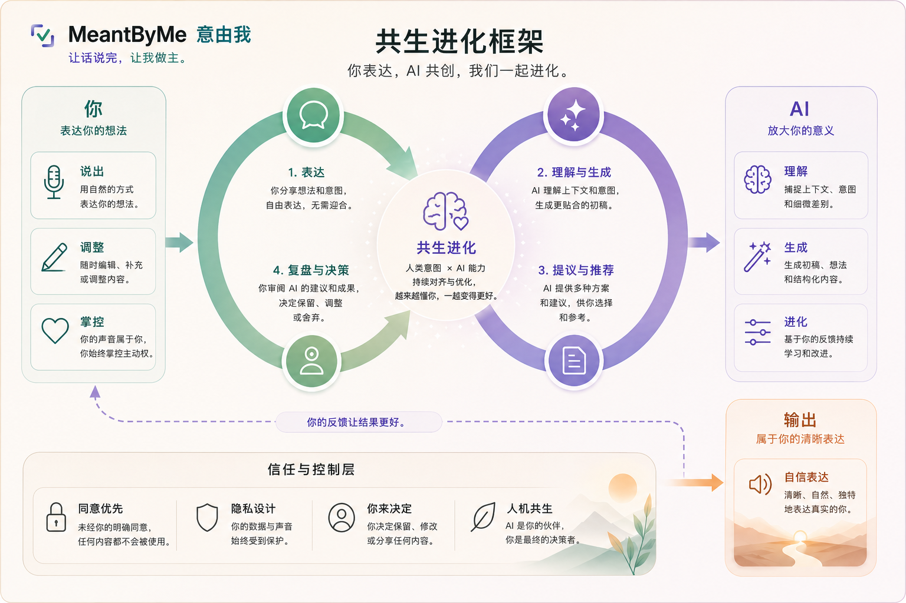

# MeantByMe｜意由我

> **让话说完，让我做主。**

[English](README.md) ·
[项目主页](https://cza1006.github.io/MeantByMe/) ·
[网页演示](https://cza1006.github.io/MeantByMe/demo.html) ·
[项目文档](docs/README.md)

## 项目简介

MeantByMe 是一个**同意优先的沟通辅助 Agent**，面向表达意图相对清晰，但语言
输出残缺、缓慢、困难或暂时不可用的人。

系统可以结合语音识别、上下文和个人记忆提出候选表达，但这些信息都只是
**证据，不是决定权**。AI 可以帮助补全句子，但最终含义、记忆写入和个人声音
授权必须由本人明确确认。

> **核心原则：AI 提议，患者决定；模型生成证据，确定性 Runtime 管理同意。**

## 共生进化框架



这里的“进化”指经过本人明确确认、保留来源且可审计的个性化改进，不代表 AI
可以根据沉默、超时、护理者操作或模型置信度自动学习、自动授权或写入 Gold
Memory。此图是产品概念图，不是临床或安全认证。

## 安全契约

- 未确认候选永远不能使用患者的个人声音。
- 沉默、超时、护理者操作、模型置信度和设备存在都不是同意。
- AI 输出不能直接写入 Gold Patient Memory。
- 护理者提供的上下文必须与患者本人确认的意图保持可区分。
- 被拒绝的候选不能变成患者偏好。
- 医疗、法律、财务及重大关系表达必须使用更严格的确认流程。
- `停止`、`返回`、`都不是`和`切换输入方式`必须始终可用。
- 每次对外表达都必须能够追溯到证据、AI 补全、确认方式和授权状态。

完整工程不变量见 [AGENTS.md](AGENTS.md)，冻结决策见
[DECISIONS.md](DECISIONS.md)。

## 简易流程

```text
残缺语音或其他输入
→ ASR 与上下文证据
→ 患者范围内的已验证记忆检索
→ 澄清或候选表达
→ 患者明确选择
→ 私密最终读回
→ 本次表达授权
→ 个人声音输出
→ Expression Receipt
→ 幂等的已验证记忆更新
```

个人声音只在“最终内容已确认”和“本次表达已授权”两个条件同时满足后使用。
复杂系统架构图仅提供英文版，见
[Reference architecture](README.md#reference-architecture)。

## 项目实现状态

当前仓库包含多个实现轨道。分支名称代表开发历史，并不等于清晰的组件边界。

| 实现轨道 | 分支 | 当前内容 | 已验证测试 |
|---|---|---|---:|
| 规范基线与项目入口 | `main` | 确定性 Mock Runtime、Schema、安全策略、文档、GitHub Pages | 24 |
| Web/后端集成原型 | `develop`、`frontend` | 同一个 commit：Runtime、Gateway、响应式 Web BFF/Demo、云端适配器、Evaluation | 142 |
| 耳机/移动端实验 | `feature/earPhones` | iOS、Viaim Headset Adapter、Command/QA、Profile Storage 实验 | 172 |

测试数量于 2026-07-26 使用 Python 3.11.8 独立验证。`develop` 与 `frontend`
当前指向同一个 commit；移动端分支是包含 iOS、后端、数据库和 Memory 改动的
综合实验分支，不能作为单一移动端补丁直接合并。

详细结论见[分支审计](docs/BRANCH_AUDIT.md)与
[当前状态](docs/STATUS.md)。

## 运行规范基线

要求 Python 3.11：

```bash
python3.11 -m venv .venv
./.venv/bin/python -m pip install -e '.[test]'
./.venv/bin/python -m meantbyme --mode mock
./.venv/bin/python -m pytest
```

Mock 流程不访问网络，使用 fixture ASR、患者范围内的 SQLite Memory、确定性
候选和缓存 TTS。只有 session 到达 `completed` 才会成功退出。

Web/Gateway 与 iOS 实验的运行方式请切换到对应分支并阅读组件 README。禁止
把 Provider Secret、真实患者数据、个人语音或生产数据库放入源码、前端包、
日志、Fixture 或 Git 提交。

## 文档与项目边界

- [文档索引与权威顺序](docs/README.md)
- [技术架构](docs/03_TECHNICAL_ARCHITECTURE.md)
- [Agent Runtime](docs/04_AGENT_RUNTIME.md)
- [Memory 与个性化](docs/05_MEMORY_AND_PERSONALIZATION.md)
- [安全、隐私与授权](docs/08_SECURITY_AND_CONSENT.md)
- [集成计划](docs/09_DEVELOPMENT_PLAN.md)
- [评测与测试](docs/11_EVALUATION_AND_TESTING.md)
- [贡献指南](CONTRIBUTING.md)
- [安全政策](SECURITY.md)

MeantByMe 是研究和沟通辅助原型，不是医疗诊断系统、治疗决策系统、读心系统或
经过临床认证的医疗器械，也不应作为紧急沟通的唯一渠道。

## 许可协议

Copyright © 2026 MeantByMe contributors。本项目采用
[MIT License](LICENSE)。该协议允许使用软件，但不授予患者数据、声音录音、
声音身份、第三方模型、厂商 SDK、名称或商标的使用权。
